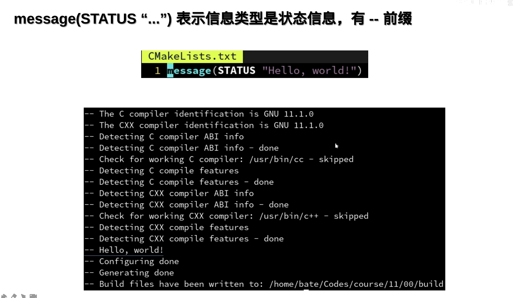
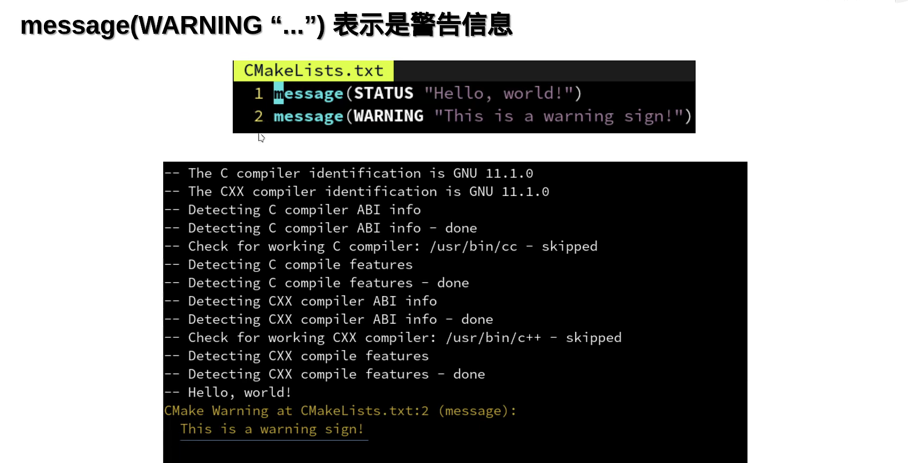
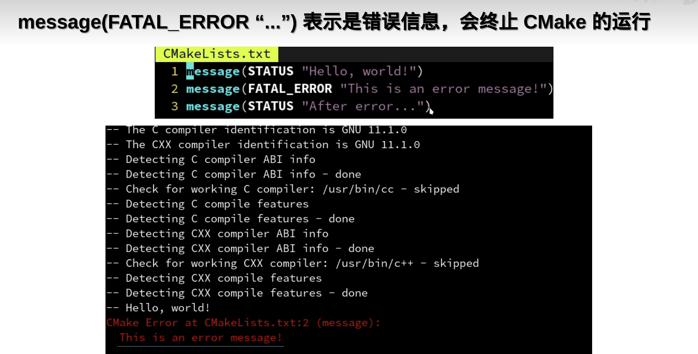
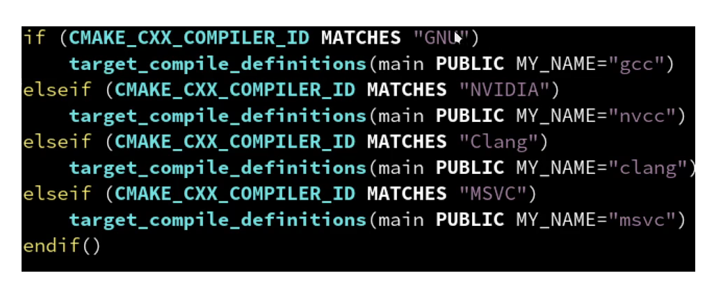
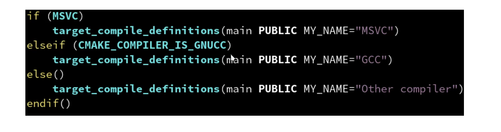
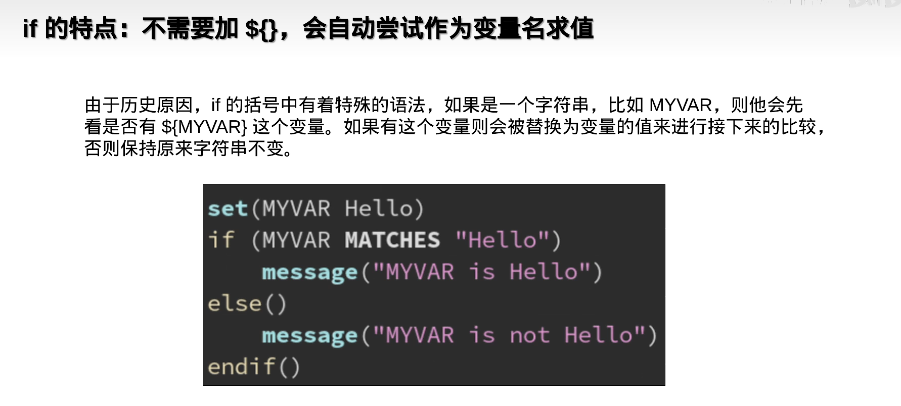
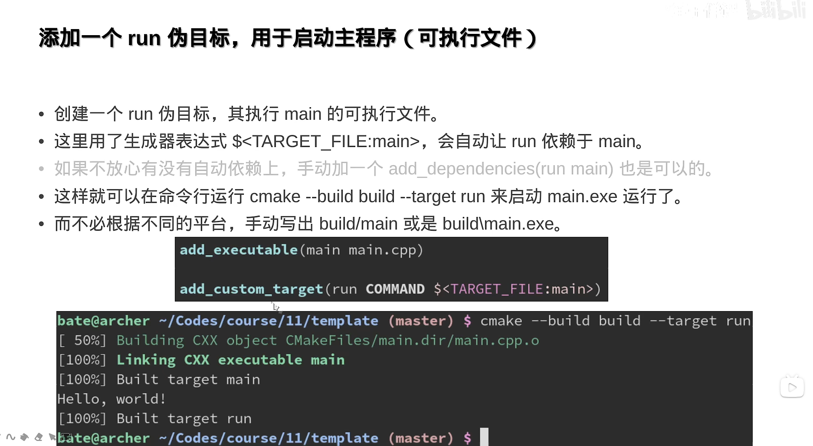
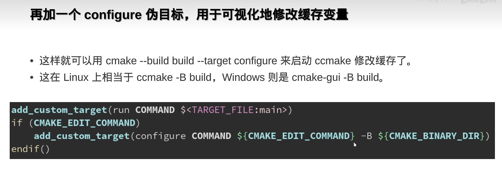

## CMAKE

## CMake 运行指令


- 项目构建和编译：

  - 在`CMakeLists.txt`目录下执行`cmake -B build`，自动构建build目录`MakeFile`
  - 再执行`cmake --build build`直接生成可执行文件
  - Windows 和 Linux 相同

- `-D`设置构建参数

- `-G`指定想要用的生成器

  

## 简单的多文件 CMake 项目组织方式

### 最简单的例子

这个例子是一个标准的多文件的 CMakeLists.txt

```cmake
cmake_minimum_required (VERSION 3.10)

set(CMAKE_CXX_STANDARD 20)
set(CMAKE_CXX_STANDARD_REQUIRED ON) # if cpp version if wrong, fault

project ("test" LANGUAGES C CXX)

# -----------------------------------optional below-------------------------------------------
if (PROJECT_BINARY_DIR STREQUAL PROJECT_SOURCE_DIR)
  message(WARNING "The binary directory of CMake cannot be the same as source directory!")
endif()

# set build type
if (NOT CMAKE_BUILD_TYPE)
  set(CMAKE_BUILD_TYPE RELEASE)
endif()

# handle Windows
if (WIN32)
  add_definitions(-DNOMINMAX -D_USE_MATH_DEFINES)
endif()

# use cache to make build faster
if (NOT MSVC)
  find_program(CCACHE_PROGRAM ccache)
  if (CCACHE_PROGRAM)
    message(STATUS "Found CCache: ${CCACHE_PROGRAM}")
    set_property(GLOBAL PROPERTY RULE_LAUNCH_COMPILE ${CCACHE_PROGRAM})
    set_property(GLOBAL PROPERTY RULE_LAUNCH_LINK ${CCACHE_PROGRAM})
  endif()
endif()

# -----------------------------------optional above-------------------------------------------

file(GLOB_RECURSE sources CONFIGURE_DEPENDS src/*.cpp)
file(GLOB_RECURSE headers CONFIGURE_DEPENDS include/*.h include/*.hpp)

add_executable (${PROJECT_NAME} ${sources} ${headers})

target_include_directories(${PROJECT_NAME} PUBLIC include)
```

项目的结构是

```
.
├── CMakeLists.txt
├── include
│   └── hello.h
└── src
    ├── hello.cpp
    └── main.cpp
```

### 文件的检索 (file)

 ```cmake
file(GLOB_RECURSE sources CONFIGURE_DEPENDS src/*.cpp)
file(GLOB_RECURSE headers CONFIGURE_DEPENDS include/*.h include/*.hpp)
add_executable(${PROJECT_NAME} ${sources} ${headers})
 ```

- `GLOB_RECURSE` 是指当前文件递归搜索
- `CONFIGURE_DEPENDS` 参数会在构建时自动更新文件目录

### 常用的属性设置 (set)

- `set (CMAKE_BUILD_TYPE Release/Debug)` 设置编译模式
- 路径变量
  - `CMAKE_CURRENT_SOUCRE_DIR` 当前`CMakeLists.txt`目录位置，有可能是子模块的目录
  - `PROJECT_BINARY_DIR` 当前项目build目录
  - `PROJECT_SOURCE_DIR` 项目project所属`CMakeLists.txt`目录位置，也就是项目最外层目录的路径
  - `CMAKE_SOURCE_DIR` <u>不建议使用</u>，会导致无法作为子模块使用

```cmake
cmake_minimum_required (VERSION 3.8)

set(CMAKE_CXX_STANDARD 20)
set(CMAKE_CXX_STANDARD_REQUIRED ON) # 如果c++版本不对，终止
set(CMAKE_CXX_EXTENSIONS OFF) # 是否使用编译器夹带的一些私活

project ("helloworld" LANGUAGES CXX C VERSION 1.1.2) # 编译语言、项目版本
```

### 常用的对象属性设置 (set_target_properties)

设置对象属性不同于set，只设置指定的对象（可执行对象，库），而不影响整个项目。`set_property`太啰嗦，推荐`set_target_properties`

```cmake
set_target_properties(<target-name> PROPERTIES
  CXX_STANDARD 17                                         # 设置 cpp 版本
  CXX_STANDARD_REQUIRED ON                                # 如果版本不对就终止
  WIN32_EXECUTABLE ON                                     # 开启后再 Windows 中运行会弹出黑框
  LIBRARY_OUTPUT_DIRECTORY ${CMAKE_SOURCE_DIR}/lib        # 动态库输出地址，默认 ${CMAKE_BINARY_DIR}
  ARCHIVE_OUTPUT_DIRECTORY ${CMAKE_SOURCE_DIR}/lib        # 静态库输出地址，默认 ${CMAKE_BINARY_DIR}
  RUNTIME_OUTPUT_DIRECTORY ${CMAKE_SOURCE_DIR}/bin        # 可执行程序输出地址，默认 ${CMAKE_BINARY_DIR}
)
```

- 👍👍👍为项目创建宏`target_compile_definitions(main PUBLIC <宏名称>)`这样在代码中`#indef <宏名称>`就可以使用
- `target_compile_definitions(main PUBLIC 宏名称=233) == #define 宏名称 233`

## 源文件组织

> Reference: [【公开课】现代CMake模块化项目管理指南【C/C++】_哔哩哔哩_bilibili](https://www.bilibili.com/video/BV1V84y117YU/?spm_id_from=333.999.0.0&vd_source=fdd56007771480ca58f731c9abc561aa)

```
.
├── CMakeLists.txt
├── biology
│   ├── CMakeLists.txt
│   ├── include
│   │   └── biology
│   │       ├── Animal.h
│   │       └── Carer.h
│   └── src
│       ├── Animal.cpp
│       └── Carer.cpp
├── cmake
│   └── MyUsefulFuncs.cmake
└── pybmain
    ├── CMakeLists.txt
    ├── include
    │   └── pybmain
    │       └── myutils.h
    └── src
        └── main.cpp
```

推荐的目录组织方式

- 如上的 biology 和 pybmain 是两个子项目 `add_subdirectory`
- 项目根目录/include/项目名/模块名.h `target_include_directories`
- 项目根目录/src/模块名.cpp
- 在源文件中使用`#include <项目名/模块名.h>`

注意事项

- 头文件要加`#pragma once`
- 头文件最好添加`namespace <项目名>`
- 如果要在头文件中实现函数定义，要添加static，避免和源文件的定义冲突；类有inline属性，是不需要加 static 的


### extern 的小知识

> extern 只会用在变量的声明时，函数和类的声明不需要
>
> `extern "c"` 和 `extern` 没有关系，[C++项目中的extern "C" {} - 吴秦 - 博客园 (cnblogs.com)](https://www.cnblogs.com/skynet/archive/2010/07/10/1774964.html)
>
> ```c++
> // 在头文件中声明全局变量
> // Header.h
> extern int globalVariable;
> 
> // 在源文件中定义全局变量
> // Source.cpp
> #include "Header.h"
> int globalVariable = 42;
> 
> // 在另一个源文件中使用全局变量
> // AnotherSource.cpp
> #include "Header.h"
> #include <iostream>
> using namespace std;
> 
> int main() {
>  cout << globalVariable << endl;  // 输出 42
>  return 0;
>    }
>    
> ```

## 库

### 复杂的例子

这个例子实现了动态/静态库的生成和调用，整个项目分为可执行程序exe 子项目、动态库子项目、静态库子项目，文件树是

```
.
├── CMakeLists.txt
├── ShareLib
│   ├── CMakeLists.txt
│   ├── include
│   │   └── helloD.h
│   └── src
│       └── helloD.cpp
├── StaticLib
│   ├── CMakeLists.txt
│   ├── include
│   │   └── helloS.h
│   └── src
│       └── helloS.cpp
└── exe
    ├── CMakeLists.txt
    └── main.cpp
```

根 cmake 文件和三个子项目的 cmake 文件如下

```cmake
# root cmake file
cmake_minimum_required (VERSION 3.10)

set(CMAKE_CXX_STANDARD 20)
set(CMAKE_CXX_STANDARD_REQUIRED ON) 

project ("test" LANGUAGES C CXX)

if (PROJECT_BINARY_DIR STREQUAL PROJECT_SOURCE_DIR)
  message(WARNING "The binary directory of CMake cannot be the same as source directory!")
endif()

# set build type
if (NOT CMAKE_BUILD_TYPE)
  set(CMAKE_BUILD_TYPE RELEASE)
endif()

# handle Windows
if (WIN32)
  add_definitions(-DNOMINMAX -D_USE_MATH_DEFINES)
endif()

# use cache to make build faster
if (NOT MSVC)
  find_program(CCACHE_PROGRAM ccache)
  if (CCACHE_PROGRAM)
    message(STATUS "Found CCache: ${CCACHE_PROGRAM}")
    set_property(GLOBAL PROPERTY RULE_LAUNCH_COMPILE ${CCACHE_PROGRAM})
    set_property(GLOBAL PROPERTY RULE_LAUNCH_LINK ${CCACHE_PROGRAM})
  endif()
endif()

add_subdirectory(StaticLib)
add_subdirectory(ShareLib)
add_subdirectory(exe)
```

```cmake
# cmake file in exe sub project
add_executable(main main.cpp)
target_link_libraries(main PUBLIC ps pd)
```

```cmake
# cmake file in sharelib sub project
file(GLOB_RECURSE sources CONFIGURE_DEPENDS src/*.cpp)
file(GLOB_RECURSE headers CONFIGURE_DEPENDS include/*.h include/*.hpp)

add_library(pd SHARED ${sources} ${headers})
target_include_directories(pd PUBLIC include)
```

```cmake 
# cmake file in staticlib sub project
file(GLOB_RECURSE sources CONFIGURE_DEPENDS src/*.cpp)
file(GLOB_RECURSE headers CONFIGURE_DEPENDS include/*.h include/*.hpp)

add_library(ps STATIC ${sources} ${headers})
target_include_directories(ps PUBLIC include)
```

- 动态/静态库的build只有参数不同，其他一致

#### 库的调用

- `target_include_directories` 用于向一个或多个目标添加头文件的搜索路径

- `target_link_directories` 用于向一个或多个目标添加链接库的搜索路径

- `target_link_libraries ` 用于链接动态/静态库，前提是可以找到库的地址[(官方文档介绍了默认的查找位置)](https://cmake.org/cmake/help/latest/command/target_link_libraries.html)。如果找不到，需要在这个命令之前调用`target_link_directories`

动态库和静态库可以理解为被翻译成机器指令的二进制形式的源代码（动态库有执行权限，静态库没有执行权限），使用它们和使用一个 C++源文件模块在原理上一样。编译器需要获得库的地址和库的头文件来实现链接。`target_link_*`用来获得库的地址，`target_include_directories`用来获得库的头文件。

```cmake
target_include_directories(main PUBLIC <lib-head-file-address>)
target_link_directories(main PUBLIC <lib-file-address>)
target_link_libraries(main PUBLIC <lib-name>)
```

==特殊情况是如果这个库是使用`add_library`创建的目标，使用`target_link_libraries`可以直接获得头文件而不用`target_include_directories` 就向上面的例子中所写==

#### 父子模块

- `add_subdirectory(子模块所在目录)`将子模块的`CMakeLists.txt`导入
- 父模块的定义传给子模块，反之不可以
- 可以添加`PARENT_SCOPE`将子模块变量传给父模块

>`include()`是直接复制粘贴；而使用`add_subdirectory`时子模块中的`${CMAKE_CURRENT_SOURCE_DIR}`和父模块不同

### Windows 的坑

在Windows（~~去死~~）中动态链接库代码前必须添加😡😡😡😡

```c++
// 动态链接库源文件
#ifdef _MSC_VER
__declspec(dllexport)
#endif

// 动态链接库头文件
#ifdef _MSC_VER
__declspec(dllimport)
#endif
```

Windows 的dll文件必须在可执行文件同目录或者在系统路径下😡😡😡😡

### 第三方库😵‍💫😵‍💫

- 在linux中库文件在`/usr/lib`头文件在`/usr/inculde`
- 在Windows中不确定😡😡😡😡
- cmake首先找到所需第三方库提供的`xxConfig.cmake`配置文件，按照说明导入组件（库的部分），再链接到项目，`find_package` 的本质就是找`xxConfig.cmake`

```cmake
// 以TBB库为例
find_package(TBB CONFIG COMPONENT tbb tbbmalloc REQUIRED) # CONFIG如果存在，就只会找config文件
add_executable(main main.cpp)
target_link_libraries(main PUBLIC TBB::tbb TBB::tbbmalloc)
```

- Windows找不到config文件解决方法（QT 为例）
  - 在`CMakeLists.txt`中添加`set(Qt5_DIR <Qt5Config目录地址>)`
  - 在命令中添加`-DQt5_DIR="<Qt5Config目录地址>"`

## 打印输出







## 跨平台






## 语法问题



## 方便使用的技巧





## CMakePresets.json

[vscode-cmake-tools/docs/cmake-presets.md at main · microsoft/vscode-cmake-tools (github.com)](https://github.com/microsoft/vscode-cmake-tools/blob/main/docs/cmake-presets.md)

[CMake Integration | Microsoft Learn](https://learn.microsoft.com/en-us/vcpkg/users/buildsystems/cmake-integration)

在vscode中，可以使用cmake-tools插件的命令按当前选择的编译器自动生成文件，如果使用了vcpkg管理包，需要添加toolchainFile，这个文件的操作类似于在terminal中`cmake --build -D....`填写了必要的参数和定义

```json
{
    "version": 3,
    "configurePresets": [
        {
            "name": "VSx86-debug",
            "displayName": "Visual Studio Community 2022 Release - x86",
            "description": "Using compilers for Visual Studio 17 2022 (x86 architecture)",
            "generator": "Visual Studio 17 2022",
            "toolset": "host=x86",
            "architecture": "win32",
            "binaryDir": "${sourceDir}/out/build/${presetName}",
            "cacheVariables": {
                "CMAKE_INSTALL_PREFIX": "${sourceDir}/out/install/${presetName}",
                "CMAKE_C_COMPILER": "cl.exe",
                "CMAKE_CXX_COMPILER": "cl.exe"
            },
            "toolchainFile": "C:/vcpkg/scripts/buildsystems/vcpkg.cmake"
        }
    ],
    "buildPresets": [
        {
            "name": "VSx86-debug-debug",
            "displayName": "Visual Studio Community 2022 Release - x86 - Debug",
            "configurePreset": "VSx86-debug",
            "configuration": "Debug"
        }
    ]
}
```

> Reference

> - [【公开课】现代CMake模块化项目管理指南【C/C++】_哔哩哔哩_bilibili](https://www.bilibili.com/video/BV1V84y117YU/?spm_id_from=333.999.0.0&vd_source=fdd56007771480ca58f731c9abc561aa)

> - [CMake 保姆级教程【C/C++】](https://www.bilibili.com/video/BV14s4y1g7Zj/?share_source=copy_web&vd_source=6b1ee003e95ed7eb76714f689d35a759)


