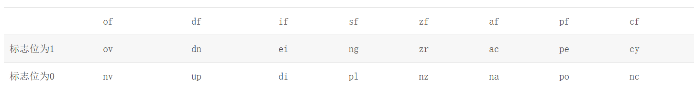
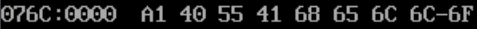
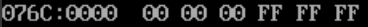
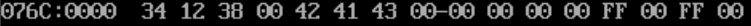
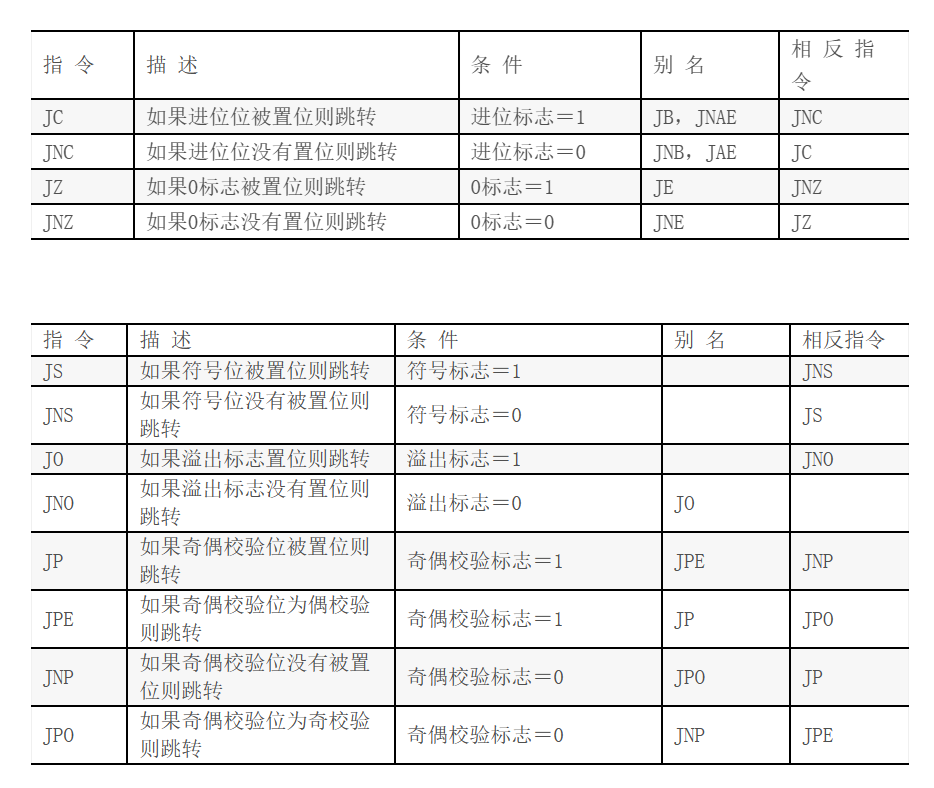
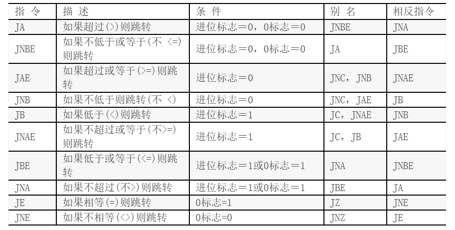
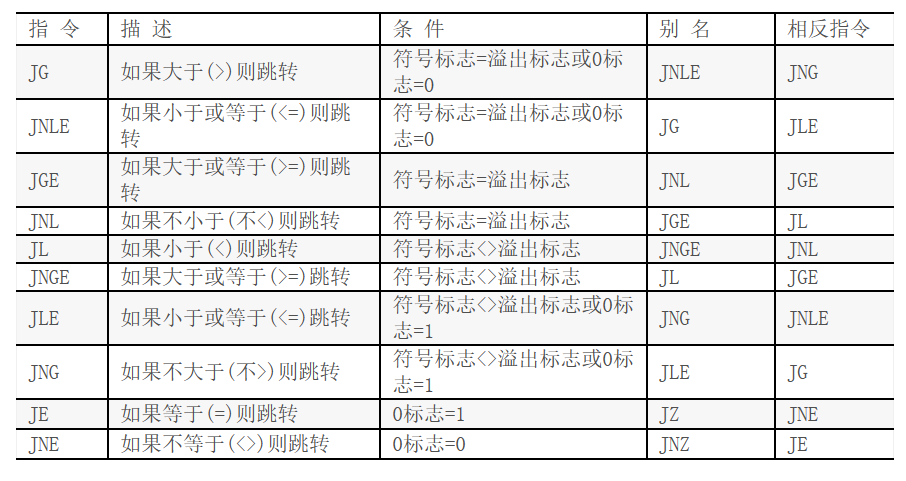
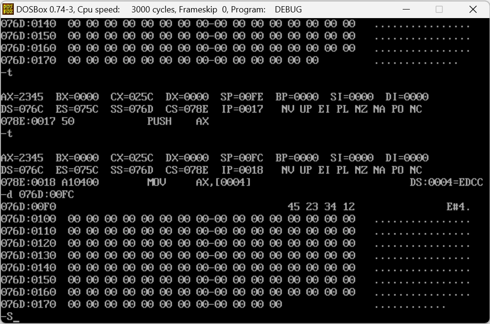

# Assembly

## 8086 instruction set

[8086 instructions (auburn.edu)](https://www.eng.auburn.edu/~sylee/ee2220/8086_instruction_set.html)

## VScode配置调试环境

1. 安装插件TASM/MASM
2. 右键扩展设置，选择Assembler：MASM
3. 右键调试即可开始调试了！

## Debug.exe

> R命令：查看、改变CPU寄存器的内容 
> D命令：查看内存中的内容
> T命令：执行一条机器指令
> G命令：从停顿的地方运行到底

**注意！！！！ x86架构采用小端法，无论是寄存器还是内存中数据的低位在存储器地址的低位，但是通常来说我们表示寄存器左边是高位，右边是低位，而我们表示内存左边是低位右边是高位。例如1234h在内存中显示3412，在寄存器中显示1234**

## 第一段代码：Hello World

```assembly
DSEG SEGMENT
        MESS DB 'Hello, World!',0DH,0AH,24H
DSEG ENDS

SSEG SEGMENT PARA STACK
             DW 256 DUP(?)
SSEG ENDS

CSEG SEGMENT
              ASSUME CS:CSEG, DS:DSEG
        BEGIN:MOV    AX,DSEG
              MOV    DS,AX
              MOV    DX,OFFSET MESS
              
              MOV    AH,9
              INT    21H
              
              MOV    AH,4CH
              INT    21H
CSEG ENDS
END BEGIN
```

## 寄存器简介

- AX     16位
- AH, AL 8位
- EAX    32位

  

### 通用寄存器

- `AX` 累加器：和乘除有关
- `BX` 基地址寄存器
  - 在8086里，内存中的地址BeLike：`204B:1001`（以16进制表示）`204B`是**段地址**，`1001`是**偏移地址**，各需要一个Word进行存储
  - BX用于存放偏移地址
- `CX` 计数器
- `DX` 数据寄存器：
  - 特殊功能和MUL/DIV有关，后面再说；也有与输入输出的暂存有关的功能

### 指针变址寄存器

- `SP`栈顶地址
- `BP`和BX有类似的用法，只是一般更倾向于用在堆栈的数据里，`[BP]`默认为`SS:[BP]`
- `SI`/`DI`
  - `[SI]`默认为`DS:[SI]`;如果要转移数据，倾向于用SI存原地址，DI存新地址

### 段寄存器

- CS 代码段寄存器
- SS 堆栈段寄存器
- DS、ES、FS、GS 数据段寄存器

#### 在实模式下物理地址的形成方式

在DOS中有地址线20根，但寄存器都是16位的，所以将地址分位段基址和偏移地址分别存入两个寄存器

- 逻辑地址 $1000H:2345H$
- 物理地址 $1000H \times 16 + 2345H = 12345H$

### 标志寄存器 FLAG

只是写代码的话不用管它
**16位**分开使用，有各自不同的意思，结果会以下面的形式呈现在-R中

在Debuger中的标志位对照表



1. **进位标志位（CF，Carry Flag）**：

   进位标志位用于处理**无符号数**的进位和借位。如果最近的操作导致进位（如加法中的进位或减法中的借位），则此标志位被设置为1，否则为0。

2. **零标志位（ZF，Zero Flag）**：

   零标志位表示最近的操作是否产生了零值结果。如果结果为零，则此标志位被设置为1，否则为0。

3. **符号标志位（SF，Sign Flag）**：

   符号标志位表示最近的操作结果的符号。如果结果为负数，则此标志位被设置为1，否则为0。

4. **溢出标志位（OF，Overflow Flag）**：

   溢出标志位用于检测**有符号数**运算的溢出。如果最近的操作导致结果溢出，此标志位被设置为1，否则为0。

5. **奇偶标志位（PF，Parity Flag）**：

   奇偶标志位表示结果中包含的 1 的位数是否为偶数。如果位数为偶数，则此标志位被设置为1，否则为0。用于奇偶性检测。

6. **辅助进位标志位（AF，Auxiliary Carry Flag）**：

   辅助进位标志位用于处理 BCD（二进制编码的十进制）算法。它在二进制数的低 4 位与高 4 位之间的进位和借位操作中发挥作用。

7. **控制标志位（TF，Trap Flag）**：

   控制标志位通常用于调试目的。当 TF 被设置为1 时，8086 处于单步执行模式，每执行一条指令后会引发一个中断，用于程序员调试。

8. **中断允许标志位（IF，Interrupt Enable Flag）**：

   中断允许标志位用于控制外部中断的处理。如果 IF 被设置为1，CPU 允许外部中断；如果被设置为0，CPU 禁用外部中断。

9. **方向标志位（DF，Direction Flag）**：

   方向标志位用于指示字符串操作（如字符串复制）的方向。当 DF 被设置为1 时，字符串操作向低地址方向移动；当被设置为0 时，向高地址方向移动。

## 基础语法

### 寻址

1. 立即寻址

   直接写操作数

   ```assembly
   MOV AX, 1234H
   ```

2. 直接寻址

   操作数在内存单元，直接写操作数所在地址

   ```assembly
   MOV AX, DS:[1234H]
   ; 直接写变量名
   MOV AL, BUF
   ```

3. 寄存器寻址
   ```assembly
   MOV AL, AH
   ```

4. 寄存器间接寻址

   操作数在内存单元，该单元的段基址在段寄存器中, 有效地址在间址寄存器中

   - BP可作为间址寄存器访问堆栈段
   - BX，SI，DI可作为间址寄存器访问数据段

   ```assembly
   MOV AX, [BX]
   MOV AX , DS:[BX] ; 与上面等价
   ```

5. 基址寻址

   该寻址方式的有效地址由两部分组成。一部分在基址寄存器中，另一部分为常量

   - BP可作为基址寄存器访问堆栈段
   - BX可作为基址寄存器访问数据段

   ```assembly
   MOV AL, [BX + 3]
   ```

6. 变址寻址、

   - 有比例因子的变址寻址其地址表达式` 段寄存器：[比例因子*变址寄存器+位移量]`
     - 比例因子只能是1、2、4、8
     - 有比例因子的只能是32位寻址，访问堆栈用EBP，访问数据用EAX等，ESI，EDI
   - 没有比例因子的变址寻址其地址表达式`段寄存器：[变址寄存器+位移量]`
     - SI, DI作为无比例因子的16为编址寄存器可以访问数据段

   ```assembly
   ;有比例因子
   MOV AH, [4 * EBX + 3]
   ;无比例因子
   MOV AH, [SI + 3]
   ```

7. 基址+变址寻址
   ```assembly
   MOV AL,[BX+SI+0250H]
   ```


---

**注意：**

1. 在实模式下，一个逻辑段的体积最大为64K，存储单元的有效地址为16位，**在实模式下运行的程序通常采用16位寻址**
2. 如用BP、EBP、ESP参与寻址，CPU自动认为是访问堆栈段，堆栈段基址SS在寻址时可以省略
3. 如用BX、SI、DI、EAX～EDX、ESI、EDI参与寻址, CPU自动认为是访问数据段，DS在寻址时可以省略

### 变量的定义

```assembly
BUF1 DB 0A1H, 64, 01010101B, 'A', 'hello'
```



```assembly
BUF2 DB 3 DUP(?)     ; equal to BUF2 DB ?,?,?
BUF3 DB 3 DUP(0FFH)
```



```assembly
BUF4 DW 1234H,56, 'AB', 'C'
BUF5 DW 2 DUP(?)
BUF6 DW 2 DUP(0FFH)
```



一些**伪指令**

- `NUM EQU 33 `定义符号常数NUM的值为33，其值在后继语句中不能更改

- `NUM = 33 `定义符号常数NUM的值为33，其值在后继语句中可以更改

- ```assembly
  BUF  DB  'THE QUICK BROWN FOX'  ;字符串长度19
  LLL  EQU $-BUF                  ; LLL = 19
  ```

- SEG运算符: 计算某一逻辑段的段基址

  ```assembly
  MOV AX, SEG  DATA
  MOV DS, AX
  ```

- OFFSET运算符 & LEA指令: 算出逻辑段中某个变量或标号名所在单元相对于段首的偏移地址。两者在功能上**相同**，但是LEA是一种**计算指令**，用于计算偏移地址，OFFSET是**伪指令**，是由汇编完成的，不是ISA规定的指令

	```assembly
	MOV  BX，OFFSET  BUF
	MOV  AL，[BX]                  
	
	;等价于
	LEA  BX，BUF
	MOV  AL，[BX]
	```

- PTR的使用要求：

  - 指令的操作数至少有一个类型属性要确定，否则必须用PTR运算符说明其中的内存操作数的类型
  - 若两个操作数的类型属性都确定，则必须保持一致。否则必须用PTR运算符改变其中的内存操作数的类型，以保持前后属性一致。

  ```assembly
  BUF DB 11,22,33
  
  MOV AX, BUF          ; ERROR
  MOV AX, WORD PTR BUF ; AH=22, AL=11
  MOV WORD PTR BUF, 4455H ; BUF = 55H, 44H, 33
  ```

### 程序的基本架构

1. 笔试版本：考试的写法

   ```assembly
   .586
   data segment USE16
   ; more datas
   data ends
   
   code segment USE16
          assume cs:code, ds:data
     beg: mov    ax, data
          mov    ds, ax
          ; more codes
          mov    ah, 4ch
          int    21h
   
   code ends
   end beg
   ```

2. 代码版本：写代码运行的简化写法

   ```assembly
   DATA SEGMENT
   ; more datas
   DATA ENDS
   
   STACK SEGMENT
   STACK ENDS
   
   CODE SEGMENT
          ASSUME DS:DATA,SS:STACK,CS:CODE
     MAIN:
          MOV    AX,DATA
          MOV    DS,AX
          ; more codes
          MOV    AH,4CH
          INT    21H
   CODE ENDS
   END MAIN 
   ```

### 常用指令

#### 四则运算

```assembly
;不考虑进位和借位
ADD AX,X	;AX+=X
SUB AX,X	;AX-=X

;考虑进位和借位
ADC AX,X
SBB AX,X

INC AX		;AX++
DEC AX		;AX--

NEG AX      ;取负 
```

- `CMP 目标操作数，源操作数`将目标操作数减去源操作数，并修改标志寄存器，两个操作数不变

#### 操作数互换

`XCHG` 两个操作数互换

```assembly
MOV    AX, 42                      ; 将AX寄存器的值设置为42
MOV    BX, 99                      ; 将BX寄存器的值设置为99

XCHG   AX, BX                      ; 使用XCHG指令交换AX和BX的值
```

#### 逻辑运算

```assembly
MOV    AX, 0FFFFH
NOT    AX
; AX == 0000H

MOV    AX, 0FFFFH
MOV    BX, 0FF00H
AND    AX, BX
; AX == FF00H

MOV    AX, 0FFFFH
MOV    BX, 0FF00H
XOR    AX, BX
; AX == 00FFH

MOV    AX, 0FFFFH
MOV    BX, 0FF00H
OR     AX, BX
; AX == FFFFH

; test将两个操作数按位与，并将结果更新到Z标志位
; 如果ax的D_0位是1，跳转到NEXT
TEST AX, 0001H
JNZ NEXT
```

> 在8086中，十六进制的书写格式是0...H，开头需要添加一个0，例如FFFF应该写成0FFFFH

1. 取反操作可以使用异或`XOR AH，0F0H`可以实现高4位取反
2. 清零操作可以使用`XOR AX,AX`，置零操作可以使用`AND AX 00H`实现低8位置零
3. 置1操作可以使用**与**1

#### 移位指令

所有数据以**补码**论处

- 算数位移适用于带符号数的运算：Shift Arithmetic -> SAL, SAR
  - 算数左移在低位补0，需要考虑溢出的问题（判断符号位和最高数据位是否一致），在移动多位的时候参见[8086 IS](https://www.eng.auburn.edu/~sylee/ee2220/8086_instruction_set.html)
  - 算数右移在高位补原先的符号位

- 逻辑位移适用于无符号数的运算：Shift            -> SHL, SHR
  - 直接补0

- 循环位移 -> ROL ROR

- 带进位的循环位移 -> RCL, 

**位移指令的第二个操作数要么是1，要么是寄存器CL**

```assembly
; 算数左移在形式上和逻辑左移一致，SHL和SAL是一致的
mov    ax, 8CCCH ; 8CCCH的符号位和最高数据位不一致，溢出
mov    cl, 1
shl    ax, cl    ; ax=9998 OF=1

mov    ax, 8CCCH 
mov    cl, 4		 ; 
shl    ax, cl		 ; ax=CCC0H OF=0 位移前后符号位没有改变，不溢出


; 算数右移在高位补原先的符号位
MOV 	AL, 0E0H      ; AL = 11100000b
SAR 	AL, 1         ; AL = 11110000b,  CF=0.

MOV 	BL, 4CH       ; BL = 01001100b
SAR 	BL, 1         ; BL = 00100110b,  CF=0.

; 循环位移
mov ax, 1234H
mov cl, 4
rol ax, cl ; ax=2341H

mov ax, 1234H
mov cl, 4
ror ax, cl ; ax=4123H
```

#### Loop

```assembly
MOV    AX, 0                       ; 初始化AX为0
MOV    CX, 10                      ; 设置循环次数，这里为10次

; 循环开始
LOOP_START:
     ADD    AX, 1                  ; 将AX寄存器的值加1
     LOOP   LOOP_START             ; 循环，CX减1，直到CX为零
```

#### jump

##### 无条件跳转

一段代码可以拥有label，Jump NAME 即可跳转至label位置
比如

```assembly
MAIN：MOV X,AX
JUMP DONE
MOV AX,Y
...
DONE:
	MOV AH, 4CH
	INT 21
```

在这段程序中，`MOV AX,Y`就会直接被跳过

##### 根据CX寄存器的值跳转

```assembly
JCXZ ; if CX is 0, jump
```

##### 根据标志寄存器跳转



使用**无符号**数比较



使用**有符号**数比较



## stack

### 初始化
#### 比较直观的（堆栈段中做定义）
1. 在堆栈段划分位置，保存栈顶位置
2. 在程序段开始的时候把堆栈段的位置告诉堆栈寄存器SS，把栈顶的位置告诉指针寄存器SP

```assembly
DSEG SEGMENT
DSEG ENDS

SSEG SEGMENT
  STACK DW 128 dup(?)
  TOP   DW LENGTH STACK
SSEG ENDS

CSEG SEGMENT
       ASSUME CS:CSEG, DS:DSEG, SS:SSEG
  MAIN:
       MOV    AX, DSEG
       MOV    DS, AX
       MOV    AX, SSEG
       MOV    SS, AX
       MOV    AX, TOP
       MOV    SP, AX


       MOV    AH,4CH
       INT    21H
CSEG ENDS
END MAIN
```

- 栈底在内存高位，栈顶在内存低位

- 栈空间地址寄存器`SS`，栈顶地址寄存器`SP`

  

创建了一个最大为`0100H`的类型为字的栈，则令`SP`初始化为`0100H`，在push之后SP-2了两次，在这里push了`1234H`和`2345H`

#### 稍微没那么直观的（程序段中划空间）

直接给SP赋值，尽量不用

```assembly
SSEG SEGMENT
SSEG ENDS
;ss:0000-ss:1000
CSEG SEGMENT
            ASSUME CS:CSEG, DS:DSEG,SS:SSEG
      BEGIN:MOV    AX,DSEG
            MOV    DS,AX
            MOV    AX,SSEG
            MOV    SS,AX
            MOV    SP,1000H                      ;手动规定了1000H的空置空间(OFFSET 0H-1000H)
```

### PUSH和POP

push和pop用于16位和32位数据的出入栈，根据操作数的位数决定，每次SP +- 2或4

### PUSHA和POPA

将通用寄存器和指针变址寄存器的值入栈，保护现场，可以依次将AX,CX,DX,BX,SP,BP,SI,DI出入栈

### 用SP和BP操作堆栈
在主程序只是暂存数据用的话，一般==不用==操作指针
但是，由于PROC需要使用到堆栈段，所以这是操作指针就是必要的，接下来在PROC中解释

## BIOS功能调用

**BIOS 键盘输入功能调用中断号16H，屏幕功能调用10H**

### 功能号01H:查询键盘缓冲区

出口参数：

1. Z标志 = 0，有输入，键代码保存在键盘缓冲区，AL=输入字符，AH=输入字符的扩展码
2. Z标志 = 1，表示无输入

```assembly
;查询键盘缓冲区
MOV AH, 01H 
INT 16H
```

### 功能号0EH:输出一个字符

将数据放到AL

```assembly
;BIOS 功能调用显示字符
MOV AH, 0EH
MOV AL, 'F'
INT 10H
```

## DOS功能调用

DOS功能调用可以实现简单的输入输出：

DOS功能调用指的是在MS-DOS（Microsoft Disk Operating System）或其他DOS操作系统下，通过中断（interrupt）来访问操作系统提供的服务和功能的一种方式。

```assembly
;框架
MOV AH, <调用号>
INT 21H
```

### 1号指令：单个字符输入

等待键入一个字符,有回显,响应Ctrl_C，内容会保存在AL

```assembly
MOV AH,1
INT 21H
```

### 10号指令：从键盘输入字符串

这个指令需要输入一个struct，struct的第一个字节需要由用户输入字符串的最大长度，第二个字节由系统写入，之后留出可以容纳最大字符串的缓冲区，只需要把整个struct的地址传入DX就可以。

```assembly
DATA SEGMENT
		; 第一种声明方法
    MAXLENGTH    DB 100           ;一个字节，用它存最大的长度
    ACTUALLENGTH DB ?             ;一个字节，用它存实际的长度，在指令执行后会被填写
    STRING       DB 100 DUP(?)    ;用来存字符串
    
    ; 第二种声明的方法
    BUF DB 100
        DB ？
        DB 100 DUP(?)
DATA ENDS

STACK SEGMENT
STACK ENDS

CODE SEGMENT
         ASSUME DS:DATA,SS:STACK,CS:CODE
    MAIN:
         MOV    AX,DATA
         MOV    DS,AX
         MOV    DX,OFFSET MAXLENGTH         ;把需要用到的内存块（三个部分）的地址存入DX

         MOV    AH,10
         INT    21H

         MOV    AH,4CH
         INT    21H
CODE ENDS
END MAIN
```

### 2号调用：单个字符输出

显示一个字符,响应Ctrl_C，数据传入DL

```assembly
MOV DL,'A'
MOV AH,2
INT 21H
```

### 9号调用：字符串输出

你的字符串必须要以'\$'结尾！不然输出不会结束！（类似于'\\0'，'\$'是一种字符串的终止符）
程序会将DS:DX地址开始输出字符到'\$'结尾

```assembly
DATA SEGMENT
    STRING       DB 'hello world', 0AH, 24H      ; 0AH换行符，24H'$'
DATA ENDS

STACK SEGMENT
STACK ENDS

CODE SEGMENT
         ASSUME DS:DATA,SS:STACK,CS:CODE
    MAIN:
         MOV    AX,DATA
         MOV    DS,AX

				 MOV    DX, OFFSET STRING
				 MOV    AH, 9
				 INT    21H 

         MOV    AH,4CH
         INT    21H
CODE ENDS
END MAIN
```

## 子程序结构

```assembly
MAIN:
CALL NM

NM PROC
...
RET
NM ENDP
...
END MAIN
```

```assembly
; e.g.
CODE SEGMENT
       ASSUME DS:DATA, SS:STACK, CS:CODE
  MAIN:
       mov    ax, DATA
       mov    ds, ax

       call   fun

fun PROC
       mov    ax, 0FFFFH
       ret
fun ENDP

       MOV    AH, 4CH
       INT    21H
CODE ENDS
END MAIN
```

