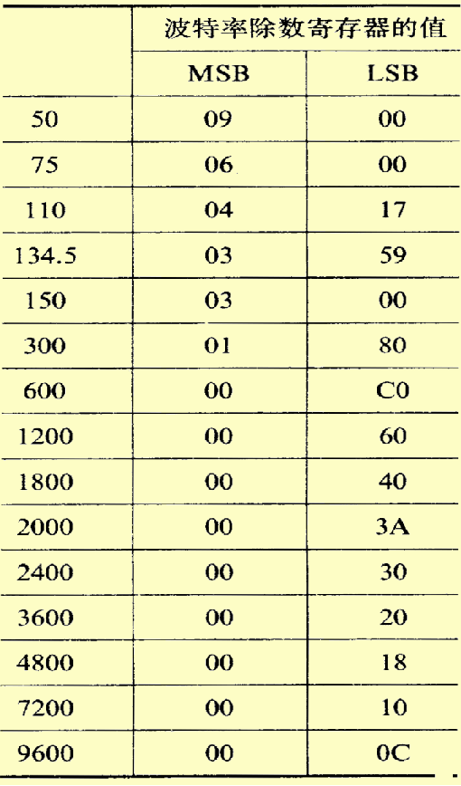

# 微机原理和接口技术

## IO

- 端口的分类：数据端口、控制端口、状态端口

- 直接寻址 I/O 指令，端口有8位，可寻址256个端口

```assembly
IN  AL, 80H          ; 将80H端口数据读到AL
IN  AX, 80H          ; 将80H数据写入AL，81H数据写入AH
IN  EAX, 80H         ; 类似上面的

OUT 80H, AL          ; 将AL数据写入80H端口
OUT 80H, AX          ; 将AL数据写入80H端口，将AH数据写入81H端口
OUT 80H, EAX         ; 类似上面的
```

- 间接寻址I/O 指令，当端口大于8位

```assembly
MOV DX, 180H          
IN  AL, DX           ; 将180H端口数据写入AL

MOV DX, 222H         
OUT DX, AL           ; 将AL数据写入222H端口
```

### 微机系统与 I/O 端口的信息交换的四种方式

#### 无条件传送方式

无条件传送方式：在**外设数据准备好**时执行IN指令，或者**输出设备空闲**时执行OUT指令

#### 查询方式

- 输入：从状态口读取状态信息，如果数据准备好就执行IN，否则循环从状态口读取状态信息
```assembly
; 设状态口地址=200H，  数据口地址=201H

RSCAN:MOV    DX, 200H
    	IN     AL, DX
      TEST   AL, 80H      ;判断D7位是否=1，如果是1，数据准备完毕，不跳转
      JZ     RSCAN        
      MOV    DX, 201H
      IN     AL, DX
```

- 输出：从状态口读取状态信息，如果外设空闲就执行OUT，否则循环从状态口读取状态信息，**数据口和状态口共用一个端口**
```assembly
; 设状态口地址=200H=数据口地址

WSCAN:MOV    DX, 200H
    	IN     AL, DX
      TEST   AL, 01H      ;判断D0位是否=0，如果是0，设备空闲，不跳转
      JNZ    WSCAN        
      MOV    DX, 200H
      MOV    AL, 44H
      OUT    DX, AL
```

#### 中断方式

- CLI 关中断
- STI 开中断

- IRET 中断返回，在中断服务程序的尾部
- INT n 软件中断指令
- INTO 中断溢出指令

##### 中断的分类

1. 外部中断：由**CPU以外的设备发出**，并由 CPU的中断请求信号引脚输入所引发的中断称为外部中断，也称为**硬件中断**。 80X86 CPU有2个引脚(INTR和NMI)可以接收外部的中断请求信号。由输入到**INTR**引脚的中断请求信号引发的中断称为**可屏蔽硬件中断**。由输入到**NMI**引脚的中断请求信号引发的中断称为**非屏蔽硬件中断**。
2. 由CPU硬件故障或程序执行中的事件所引发的中断称为内部中断。**内部中断可以进一步分为软件中断和异常**。执行有定义的INT n指令而引发的中断,称为软件中断。**软件中断可分为BIOS中断、DOS中断**。**软件中断不可屏蔽。**由于CPU本身故障、程序故障等引发的中断，称为**异常**。

##### 中断向量

中断向量是实模式下，中断服务子程序的入口地址

它由2部分组成:（按顺序）

1. 服务程序入口的偏移地址（2个字节）

2. 服务程序所在代码段的段基址（2个字节）

##### 中断向量表

中断类型码通过一个地址指针表与中断服务程序的入口地址相联系：     

实模式下：该表称为中断向量表；

保护模式下：该表称为中断描述符表。 

中断向量表在RAM的（00000H ～ 003FFH)地址，共1K单元

- 可以使用DOS的35H获取中断向量
  - input: AH = 35H, AL = 中断号
  - output: ES: BX = 中断向量
- 可以使用DOS的25H修改中断向量
  - input: AH = 35H, AL = 中断号, DS = 中断服务程序所在的段基址, DX = 中断服务程序所在的段偏移地址

##### 8259A

- IRR是中断请求控制器。它保存从IR0-IR7来的中断请求信号。某一位有1就表示相应引脚上有中断请求信号。中断响应后，该IR输入线上的请求信号应该撤销。

- ISR是中断服务寄存器。它用于保存正在服务的中断源。在中断响应时，判优电路把发出中断请求的中断源中优先级最高的中断源所对应的位设置为1，表示该中断源正在处理中。ISR某一位置1课阻止与它同级和更低优先级的请求被响应，但允许更高优先级的请求被响应。

- **IMR是中断屏蔽寄存器**。它用于存放中断控制字，其中为1的位表示对应的中断请求输入将被屏蔽。

**硬件中断源和终端类型对照表**

| 主8259 | 中断源  | 中断类型 | 从8259 | 中断源   | 中断类型   |
| ------ | ------- | -------- | ------ | -------- | ---------- |
| IR0    | 日时钟  | 08H      | IR0    | 实时时钟 | 70H        |
| IR1    | 键盘    | 09H      | IR1    | 用户中断 | 71H改向0AH |
| IR2    | 从8259  |          | IR2    | 保留     | 72H        |
| IR3    | 辅串口  | 0BH      | IR3    | 保留     | 73H        |
| IR4    | 主串口  | 0CH      | IR4    | 保留     | 74H        |
| IR5    | 并行口2 | 0DH      | IR5    | 协处理器 | 75H        |
| IR6    | 软盘    | 0EH      | IR6    | 硬盘     | 76H        |
| IR7    | 并行口1 | 0FH      | IR7    | 保留     | 77H        |

**系统分配给主从8259A的口地址**

| 芯片    | 奇地址（中断屏蔽寄存器口） | 偶地址（接收中断结束命令口） |
| ------- | -------------------------- | ---------------------------- |
| 主8259A | 21H                        | 20H                          |
| 从8259A | A1H                        | A0H                          |

###### 日时钟中断

例：日时钟源是8254 0#计数器，每55ms发出一次中断请求，要求每1s打印一个字符串，打印10次终止。$55 \times 18 = 990 \approx  1000$

1. 法1：置换1CH中断向量

```assembly
.486
data segment use16
    mesg   db 'helloworld', 0ah, '$'
    icount db 18
    count  db 10
    old    dd ?
data ends

code segment use16
           assume ds: data, cs: code
    beg:   
           mov    ax, data
           mov    ds, ax

    ; store and rewrite interrupt vector
           cli
           call   read
           call   write
           sti

    ; main loop, if print str 10 times, go to reset
    scan:  cmp    count, 0
           jnz    scan

           cli
           call   reset
           sti

           mov    ah, 4ch
           int    21h

    ; interrupt server
server proc
           pusha
           push   ds
           mov    ax, data
           mov    ds, ax
           dec    icount
           jnz    exit
           mov    icount, 18
           dec    count
           mov    ah, 9
           mov    dx, offset mesg
           int    21h
    exit:  
           pop    ds
           popa
           iret
server endp

    ; read and store the old interrupt vector
read proc
           mov    ax, 351ch
           int    21h
           mov    word ptr old, bx
           mov    word ptr old+2, es
           ret
read endp

    ; write user defined interrupt server vector
write proc
           push   ds

           mov    ax, seg server
           mov    ds, ax
           mov    dx, offset server

           mov    ax, 251ch
           int    21h

           pop    ds
           ret
write endp

; write back the former vector
reset proc
           push   ds
           mov    dx, word ptr old
           mov    ds, word ptr old+2
           mov    ax, 251ch
           int    21h
           pop    ds
           ret
reset endp

code ends
end beg
```

2. 法2：置换08H中断向量，相比法1，有三点不同
   1. 所有的DOS 25H，35H中调用的接口改为08H
   2. 中断服务程序中`mov ax, data`和`mov ds ax` 没有了
   3. 中断服务程序的结尾不是`iret`而是`jmp old`

###### 用户中断

例：8254每100ms发送一次中断请求，要求每1秒打印一个字符串，直到键盘按下终止。

```assembly
.486
data segment use16
    mesg   db 'helloworld', 0ah, '$'
    icount db 10
    old    dd ?
data ends

code segment use16
           assume ds: data, cs: code
    beg:   
           mov    ax, data
           mov    ds, ax

    ; store and rewrite interrupt vector
           cli
           call   read
           call   write
           call   i8259a
           sti

    ; main loop, if print str 10 times, go to reset
    scan:  mov    ah, 1
           int    16h
           jz     scan

           cli
           call   reset
           sti

           mov    ah, 4ch
           int    21h

    ; interrupt server
server proc
           pusha
           push   ds
           mov    ax, data
           mov    ds, ax
           dec    icount
           jnz    exit
           mov    icount, 10
           mov    ah, 9
           mov    dx, offset mesg
           int    21h
    exit:  
    ; sent end message to 8259a
           mov    al, 20h
           out    20h, al

           pop    ds
           popa
           iret
server endp

    ; read and store the old interrupt vector
read proc
           mov    ax, 350ah
           int    21h
           mov    word ptr old, bx
           mov    word ptr old+2, es
           ret
read endp

    ; write user defined interrupt server vector
write proc
           push   ds

           mov    ax, seg server
           mov    ds, ax
           mov    dx, offset server

           mov    ax, 250ah
           int    21h

           pop    ds
           ret
write endp

i8259a proc
    ; enable subordinate 8259
           in     al, 0a1h
           mov    al, 11111101B
           out    0a1h, al
    ; enable principal 8259
           in     al, 21h
           mov    al, 11111011B
           out    21h, al
           ret
i8259a endp

    ; write back the former vector
reset proc
           push   ds
           mov    dx, word ptr old
           mov    ds, word ptr old+2
           mov    ax, 250ah
           int    21h
           pop    ds
           ret
reset endp

code ends
end beg
```

#### **DMA方式**

**特点：**

- **用硬件实现在外设与内存间直接进行数据交换，而不通过CPU**
- **数据传送速度的上限就取决于存储器的工作速度**
- **速度快**

## 串行通信

串行通信：一条道，一个一个走；并行通信：多条道，全部一起走

### 8250内部寄存器

- 发送保持寄存器(3F8H/2F8H)

  - 该寄存器保存CPU传送来的并行数据，并转移至发送移位寄存器

- 接收缓冲寄存器(3F8H/2F8H)

  - 接收移位寄存器，去掉起始位，校验位和停止位，转换成并行数据，转换后的并行数据存入接收缓冲寄存器，等待CPU接收。

- 通信线状态寄存器 (3FDH/2FDH)

  - 寄存通信线状态

- 中断允许寄存器(3F9H/2F9H)

- 中断识别寄存器(3FAH/2FAH)

  - 由于8250仅能向CPU发出一个总的中断请求信号,为了识别是哪一个中断源引起的中断，应在转入中断服务程序之后，读取中断识别寄存器的内容进行判断，然后再转入相应的处理程序。

- MODEM控制寄存器(3FCH/2FCH)

  - 在8250用中断方式与CPU交换信息时，D3应=1
  - 在8250用查询方式与CPU交换信息时，D3应=0

- 除数寄存器（高8位3F9H/2F9H,低8位3F8H/2F8H)

  - 存放初始化时编程时写入的分频系数

  - $$
    分频系数 = \frac{1.8432M}{16 \times 波特率} = \frac{64^2\times450}{16 \times 波特率}
    $$

- 通信线控制寄存器(3FBH/2FBH)

  - 该寄存器主要用于指定串行异步通信的数据格式

### 8250初始化

**用户可以自定义的部分**

1. 使用主/辅串口
2. 波特率 -> 除数寄存器（高8位3F9H/2F9H,低8位3F8H/2F8H)

- 将4byte分频系数分高低位先后写入除数寄存器
- 

3. 串行通信的格式 -> 通信线控制寄存器(3FBH/2FBH)

- 将控制字写入通信线控制寄存器

4. 设置中断允许 -> 中断允许寄存器(3F9H/2F9H)

- 将**中断允许位**写入中断允许寄存器，D0是接收中断使能，D1是发送中断使能

5. 是否使用中断&是否自发收 -> MODEM控制寄存器(3FCH/2FCH)

- 将**MODEM控制字**写入MODEM控制寄存器，如果使用中断方式，D3置1，如果自循环，D4置1

- 正常通信，不中断：MODEM控制字 = 0000 0000 B
- 正常通信，会中断：MODEM控制字 = 0000 1000 B
- 自发自收，不中断：MODEM控制字 = 0001 0000 B
- 自发自收，会中断：MODEM控制字 = 0001 1000 B

基本格式(主串口)

```assembly
I8250 PROC
    ; 寻址位置1，通信线控制寄存器
           MOV    DX, 3FBH
           MOV    AL, 80H
           OUT    DX, AL
    ; 置分频系数，先高8位后低8位
           MOV    DX, 3F9H
           MOV    AL, 分频系数高八位
           OUT    DX, AL
           MOV    DX, 3F8H
           MOV    AL, 分频系数低八位
           OUT    DX, AL
    ; 定义数据格式，通信线控制寄存器
           MOV    DX, 3FBH
           MOV    AL, 数据格式定义
           OUT    DX, AL
    ; 中断允许寄存器
           MOV    DX, 3F9H
           MOV    AL, 中断允许位
           OUT    DX, AL
    ; MODEM控制寄存器
           MOV    DX, 3FCH
           MOV    AL, 中断使能定义&是否循环
           OUT    DX, AL
           RET
I8250 ENDP
```

### 查询方式收发

```assembly
; 利用主串口查询方式发送一个'A'
SCAN:  MOV    DX, 3FDH
       IN     AL, DX
       TEST   AL, 20H
       JZ     SCAN
       MOV    DX, 3F8H
       MOV    AL, 'A'
       OUT    DX, AL

; 利用主串口查询方式接收一个字符
SCAN:  MOV    DX, 3FDH
       IN     AL, DX
       TEST   AL, 01H
       JZ     SCAN
       MOV    DX, 3F8H
       IN     AL, DX
```


## **8254定时/计数器**

### **常用工作方式**

- **方式2: 分频器(脉冲发生器)**
- **方式3: 方波发生器**

> **其他看例题就行，附录中有详细的控制字手册**

## 并行接口8255A

### 结构

- 24根端口数据线**接外设**    
  - PA7~PA0为A口数据线         
  - PB7~PB0为B口数据线         
  - PC7~PC0为C口数据线

- 8根系统数据线**接CPU**
  - D7~D0，CPU通过数据线写控制字和数据，也可以接收数据

- 6根输入控制线  

  - RESET：复位信号，RESET=1时，8255内部复位，所有内部寄存器清零，A、B、C三个端口自动为输入口         

  - CS：片选信号，CS=0时，该芯片被选中        

  - RD：来自CPU的I/O读命令        

  - A1、A0：通常接CPU的地址线A1、A0
  - WR：来自CPU的I/O写命令         

### 三种工作方式

| 工作方式        | 适用端口 |
| --------------- | -------- |
| 方式0：基本型IO | A, B, C  |
| 方式1：选通型IO | A, B     |
| 方式2：双向传输 | A        |

#### 方式0

- 输入：执行IN，8255将数据从对应端口传到CPU
- 输出：执行OUT，CPU将数据传给8255,8255将数据锁存到对应端口

#### 方式1

- 输入：

- 输出：


