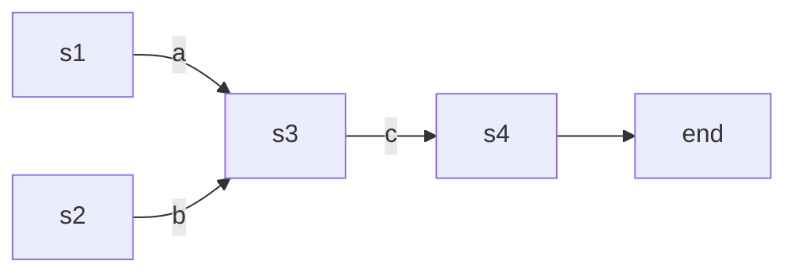

# Setting up navigation

A clear and concise navigation structure is an important aspect of good project
documentation. Material for MkDocs provides a multitude of options to configure
the behavior of navigational elements, including [tabs] and [sections], and one
of its flagship features: [instant loading].

  [tabs]: #navigation-tabs
  [sections]: #navigation-sections
  [instant loading]: #instant-loading


## Commands

* `mkdocs new [dir-name]` - Create a new project.
* `mkdocs serve` - Start the live-reloading docs server.
* `mkdocs build` - Build the documentation site.
* `mkdocs -h` - Print help message and exit.

## Project layout

``` c++
class String {
  // 拷贝构造函数
  String(const String& s); 
    
  // 拷贝赋值运算符
  String& operator=(const String& s) {
    if (this == &other) {
      return *this;
    }
    delete[] str;
    int len = strlen(other.str) + 1;
    str = new char[len];
    strcpy(str, other.str);
    return *this; // 为了实现链式赋值 a=b=c
  }
    
  // 移动构造函数
  String(String&& other) noexcept {
    str = other.str;       
    other.str = nullptr;   
  }
    
  // 移动赋值运算符重载
  String& operator=(String&& other) noexcept {
    if (this == &other) {
      return *this; 
    }
    delete[] str;     
    str = other.str;  
    other.str = nullptr;
    return *this;
  }
}
```

$$
\int_{3}^{4} \cos x dx
$$



$$
\left[\begin{array}{l}
x^{\prime} \\
y^{\prime}
\end{array}\right]=\left[\begin{array}{ll}
a & b \\
c & d
\end{array}\right]\left[\begin{array}{l}
x \\
y
\end{array}\right]
$$


| dsafe      | wefaf     | efrsdf       |
| ---------- | --------- | ------------ |
| e          | sdfawefds |              |
|            |           | xwefaewfdsaf |
| aefewfefds |           |              |
