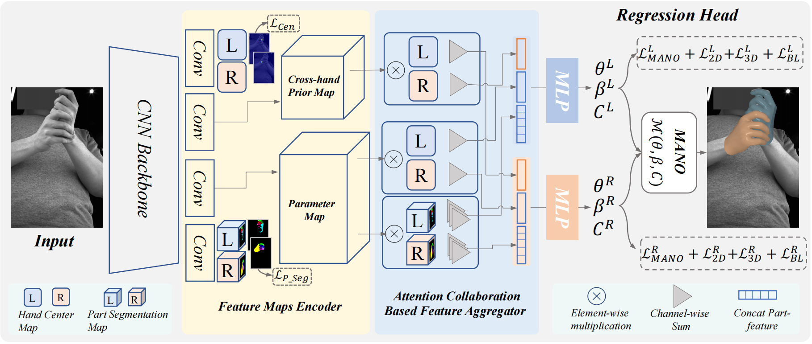

# 基于手部重建的 Unity 交互

## Abstract

基于单目摄像头的手部重建经过多年的发展，已经较为成熟。本项目使用 2023 CVPR 的论文提出的手部重建模型 ACR，在 Unity 中实现了一个基本的手部和虚拟物体的交互。

## Performance

下图显示的左边手部模型在 Unity 场景中呈现的效果，右边是 webCamera 捕捉的画面

## Related Work

本项目的主要工作是

1. 运行 ACR 模型实时重建手部的三维模型
2. 将模型的顶点数据传输给 Unity
3. 在 Unity 场景中实时显示手部的模型
4. 实现手部模型和虚拟场景中物体的交互

### Hand  Reconstruction

本项目采用 2023 CVPR 论文 “**ACR: Attention Collaboration-based Regressor for Arbitrary Two-Hand Reconstruction**” 的模型重建实时的手部三维重建。

输入：单目 RGB 图像

输出：双手的 Mesh

### TCP Connection

为了将 ACR 输出的模型实时传入Unity，本项目建立了 Python-C# 的 TCP 通信连接。Python 端作为 TCP client，使用 `socket` 实现 TCP 通信。C# 端作为 TCP server，使用 `NetworkStream` 实现 TCP 通信。

Unity 的帧渲染和 ACR 的模型预测频率不同，顶点数据的接收不应该运行在 Unity 主进程之上。由于 Unity API 只能在主进程运行，我们使用一个调度器 (Dispatcher) 实现 TCP 接收线程和模型更新脚本的通信。调度器维护了一个消息队列，TCP 接收线程在接收到顶点数据后将数据存入消息队列，在主线程中每一帧检测消息队列，如果不为空，就触发模型更新事件脚本。

### Per-vertex Animation

传统的基于骨骼绑定的动画在关节弯曲的地方有可能出现不自然的形变，工业界通常使用优化过的更复杂的骨骼来避免这种情况，MANO 模型则使用神经网络优化了这种情况。ACR 模型使用了 MANO 模型，这意味着获得我们无法再 Unity 中使用骨骼动画来实现手部模型的更新。我们的解决方案是使用顶点动画，也就是在维持三角形拓扑结构的前提下更改每个顶点的空间坐标以实现模型的更新。

在具体实现的过程中，我们发现中的模型资产导入器对三角形的处理和其他软件，如 Blender, python-trimesh 不同，为了正确实现顶点动画，我们重写了 Unity OBJ enporter。

### Dirve Virtual Interaction

我们参考了 [Meta Quest head track](https://www.meta.com/help/quest/articles/headsets-and-accessories/controllers-and-hand-tracking/hand-tracking/) 的交互思路，使用一些指定的手势来触发对应的交互事件。由于 ACR 对手的位置的预测在 z-axis 存在帧间关联性不足的原因，我们没有办法实现在 z-axis 上的交互。

当手部的模型靠近物体的时候可以通过拇指和食指捏合动作触发抓取事件，将物体提起。

## Limitations

1. 我们使用的手部重建模型 ACR 没有利用帧间的关联信息，这导致在 Unity 中交互的时候缺乏连贯性。
2. ACR 模型过于庞大，预测帧率低。
3. ACR 只开放了预测程序和预训练模型，没有开放训练代码，且 `Attention Collaboration` 部分的耦合性很高，难以实现模型的轻量化优化。
4. 我们也尝试过其他的一些小参数模型，例如 MobRecon。但是这些模型都基于 FreiHAND 之类的数据集，难以实现手部在相机空间内的位置追踪。

## Reference

Yu Z, Huang S, Fang C, et al. ACR: Attention Collaboration-based Regressor for Arbitrary Two-Hand Reconstruction[C]//Proceedings of the IEEE/CVF Conference on Computer Vision and Pattern Recognition. 2023: 12955-12964.

Han S, Liu B, Cabezas R, et al. MEgATrack: monochrome egocentric articulated hand-tracking for virtual reality[J]. ACM Transactions on Graphics (ToG), 2020, 39(4): 87: 1-87: 13.

Chen X, Liu Y, Dong Y, et al. Mobrecon: Mobile-friendly hand mesh reconstruction from monocular image[C]//Proceedings of the IEEE/CVF Conference on Computer Vision and Pattern Recognition. 2022: 20544-20554.