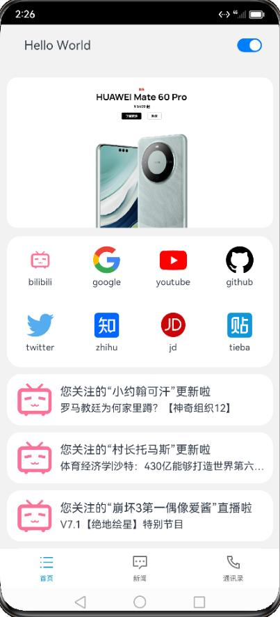
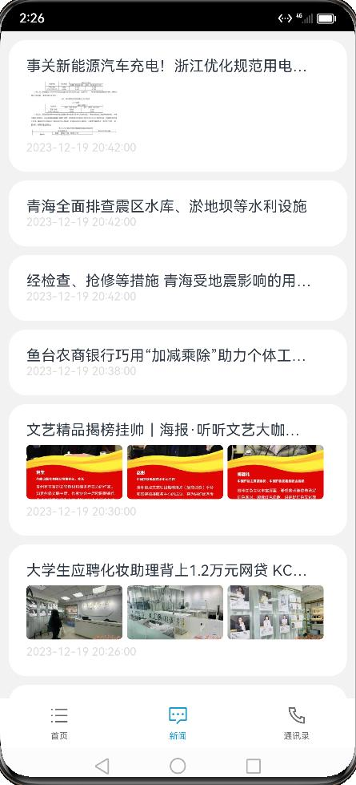
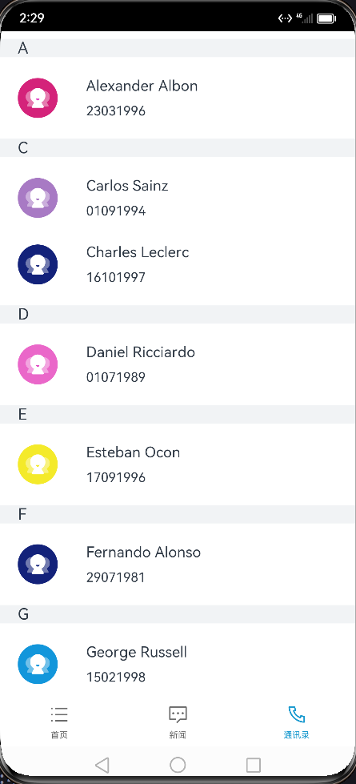

# HarmonyOS 应用开发

> 学校开了一门 Harmony 应用开发的实践课，这里记录一下一部分实验报告

## 环境
- Windows 11
- DevEco Studio
- HarmonyOS SDK 3.1.0 (API 9)
- Local Emulator (API 9)

## 页面效果






## 设计
- 底部菜单栏，有多个菜单。
- 首页布局自定义，可采用宫格布局，集成轮播图，导航到各自的内容页。
- 新闻分类导航，使用列表左菜单+轮播布局联动，加载分类新闻，包括新闻浏览、新闻图片、新闻作者、新闻发布时间。
- 通讯录，利用MySQL数据库、Python Flask框架、内网穿透，提供通讯录服务

```cpp
ets
├─constant
│      constants.ets           // 定义了一些全局的常量
├─entryability                 // 系统对页的一些config
│      EntryAbility.js
│      EntryAbility.js.map
│      EntryAbility.ts
└─pages                        // 定义的三个页面
       Index.ets	             // 启动页
       Main.ets                // 程序主页，使用 Tab 容器实现功能页的跳转
       net.ets                 // 用于显示网站
```

### 程序主体页面设计

当页面信息较多时，为了让用户能够聚焦于当前显示的内容，需要对页面内容进行分类，提高页面空间利用率。所以我采用导航组件Tab来实现优雅直观的页面导航。Home.ets，News.ets,Phone.ets分别是Home页，新闻页和通讯录页三个具体功能页的实现。通过底部导航栏进入对应页。

### Home页面设计

Home页面作为一个信息密度较高的内容导航终端，包含了手机新品动态，主要网站的导航和Bilibili消息推送的整合呈现。
- 显示手机新品动态的轮播（Swiper）组件
- 主要网站的导航采用网格（Grid/GridItem）组件排列
- Bilibili消息推送采用带有scroller工具的列表（List）组件实现

### 新闻页面设计

页面布局采用带有scroller工具的列表（List）组件实现，每个项可以根据获得的新闻包含的图片数量自适应显示。

新闻页使用@ohos.net.http的request函数获取http数据，该函数是异步函数，我采用async/await语法糖来实现异步接收http数据，并将jsonString转为Object

新闻的显示采用List组件

### 通讯录页

通讯录页在布局上采用带有scroller工具的列表（List）组件实现，但在此基础上实现了按人名首字符分组排序的功能，使得检索更加方便

通讯录的http接收和新闻在方法上相同。但有一个坑点：

Object如果“经过”@State装饰器，其中的reference可能被抹去，所以需要使用深拷贝，避免Object中的数据被JS垃圾回收机制抹去。

通讯录数据存储在MySQL数据库中

```mysql
mysql> select * from calldata.phonenum;
+------------------+-----------+--------------+
| name             | num       | first_letter |
+------------------+-----------+--------------+
| Alexander Albon  | 23031996  | A            |
| Carlos Sainz     | 01091994  | C            |
+------------------+-----------+--------------+
22 rows in set (0.00 sec)
```

使用Python将mysql数据以JSON格式用HTTP写一传输到计算机本地端口

使用内网穿透将该内网端口连接到一个公网IP


## 服务卡片的导航

服务卡片的导航的思路是：

点击卡片的不同位置，卡片在跳转的时候会传递相应的参数，page在收到这个参数后跳转到指定的Tab页。

具体来说：在服务卡片向FormExtensionAbility传输参数，FormExtensionAbility以使用Want将数据传给UIAbility，UIAbility收到数据后存入变量，页面使用LocalStorageLink装饰的变量接收数据，并跳转到对应页面。

```js
// 在服务卡片中，在点击后调用这个函数，传递 param
tab_router(page: string, tab: string) {
 postCardAction(this, {
 "action": this.ACTION_TYPE,
 "abilityName": this.ABILITY_NAME,
 "params": {
 "targetPage": page,
 "targetTab": tab
 }
 });
}
// EntryAbility.ts
// 在 EntryAbility 收到 entryFromAbility 发出的 Want 时调用
onNewWant(want, launchParam) {
 if (want.parameters.params !== undefined) {
 let params = JSON.parse(want.parameters.params);
 selectPage = params.targetPage;
 let selectTab = storage.link("selectTab")
 selectTab.set(params.targetTab)
 }
 if (currentWindowStage != null) {
 this.onWindowStageCreate(currentWindowStage);
 }
}
// Main.ets
// 使用 LocalStorageLink 来获取 EntryAbility 收到的 param
let storage = LocalStorage.GetShared()
@Entry(storage)
@Component
struct Main {
 @LocalStorageLink('selectTab') selectTab: string = "";
 // ....
}
```


